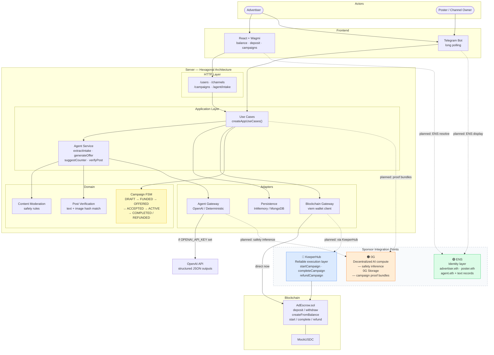

# Architecture

## System Diagram

## Current Implementation Status

| Layer | Status |
|---|---|
| Smart contract (escrow lifecycle) | Done |
| Campaign FSM (14 states) | Done |
| Telegram bot commands | Done |
| AI agent gateway (OpenAI + fallback) | Done |
| Post verification (text/image match) | Partial — Telegram scraping stubbed |
| Random/final check scheduler | Missing |
| Settlement auto-trigger | Missing — wired but not called automatically |

## Sponsor Integration Plan

### KeeperHub (Priority 1)
Replace direct `viem` calls for `startCampaign`, `completeCampaign`, and `refundCampaign` with KeeperHub execution. Introduce a `ContractExecutionService` abstraction with two implementations: `DirectViemExecutionService` (current) and `KeeperHubExecutionService`.

### ENS (Priority 2)
- Resolve ENS names for advertiser/poster addresses in bot messages and web UI
- Register an ENS name for the settlement agent wallet
- Optionally store poster channel metadata in ENS text records (`com.grandma-ads.telegram`)

### 0G (Priority 3)
- Run content safety classification through 0G Compute instead of local rules
- After each campaign settlement, write a proof bundle JSON to 0G Storage (approved text hash, image hash, verification logs, final outcome)
